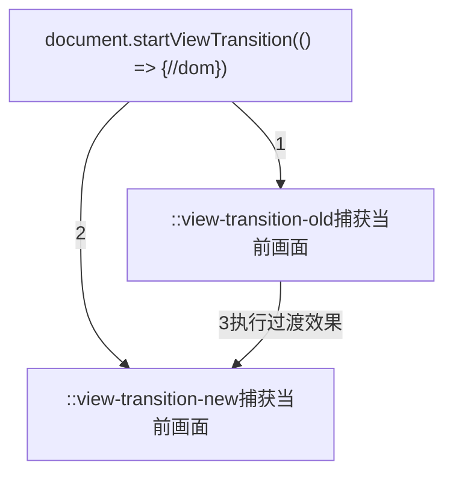

---
sidebar:
 title: 聚焦式切换主题模式-light/dark
 step: 10
isTimeLine: true
title: 聚焦式切换主题模式-light/dark
date: 2024-02-23 15:00:00
author: 马凯
tags:
 - 前端
 - JavaScript
 - demo
categories:
 - 前端
---

# 聚焦式切换主题模式-light/dark

## 知识点罗列

- [View Transition](https://developer.mozilla.org/zh-CN/docs/Web/API/View_Transitions_API)
- [Element.animate](https://developer.mozilla.org/zh-CN/docs/Web/API/Element/animate)
- [clip-path](https://developer.mozilla.org/zh-CN/docs/Web/CSS/clip-path)

## 效果示例
:::demo
project/theme-toggle.vue
:::

## 知识点介绍以及使用

> [View Transition](https://developer.mozilla.org/zh-CN/docs/Web/API/View_Transitions_API)是谷歌浏览器提供的一个新特性，也叫做视图转换动画，或者转场动画能有平滑有效的实现动画的切换效果。

::view-transition表示视图过渡层叠层的根元素，他的结构大概有四层，它包含所有视图过渡且位于所有其他页面内容的顶部，也就是说他的相对父级是HTML元素

在视图过渡期间，::view-transition 包含在相关的伪元素树中，它是该树的顶级节点，并且有一个或多个 ::view-transition-group 子节点。

[视图过度过程结构如下](https://developer.mozilla.org/zh-CN/docs/Web/API/View_Transitions_API#%E8%A7%86%E5%9B%BE%E8%BF%87%E6%B8%A1%E8%BF%87%E7%A8%8B)：

- [::view-transition](https://developer.mozilla.org/zh-CN/docs/Web/CSS/::view-transition)
- └─ [::view-transition-group(root)](https://developer.mozilla.org/zh-CN/docs/Web/CSS/::view-transition-group)
   - └─ [::view-transition-image-pair(root)](https://developer.mozilla.org/zh-CN/docs/Web/CSS/::view-transition-image-pair)
      - ├─ [::view-transition-old(root)](https://developer.mozilla.org/zh-CN/docs/Web/CSS/::view-transition-new)
      - └─ [::view-transition-new(root)](https://developer.mozilla.org/zh-CN/docs/Web/CSS/::view-transition-old)

> 以上视图切换过程仅用于了解其运作原理，核心在于一行JS代码，---> **document.startViewTransition**,该函数用于启动视图转换

整体过程如下：
1. 调用document.startViewTransition浏览器会捕捉当前页面的状态以及画面
2. 执行dom变化，之后会再次记录变化后的页面状态，也是类似于捕获画面
3. 触发两个状态之间的过度，例如颜色、宽高、背景、位移等变化，也可以是animation动画

该过程可以通过document.documentElement.animate函数触发、更改class、启用animation等

### [MDN官方示例入口👈👈👈👈](https://mdn.github.io/dom-examples/view-transitions/#)

## 参考与引用
1. [太丝滑了！了解一下原生的视图转换动画 View Transitions API](https://blog.csdn.net/xgangzai/article/details/134131242)
