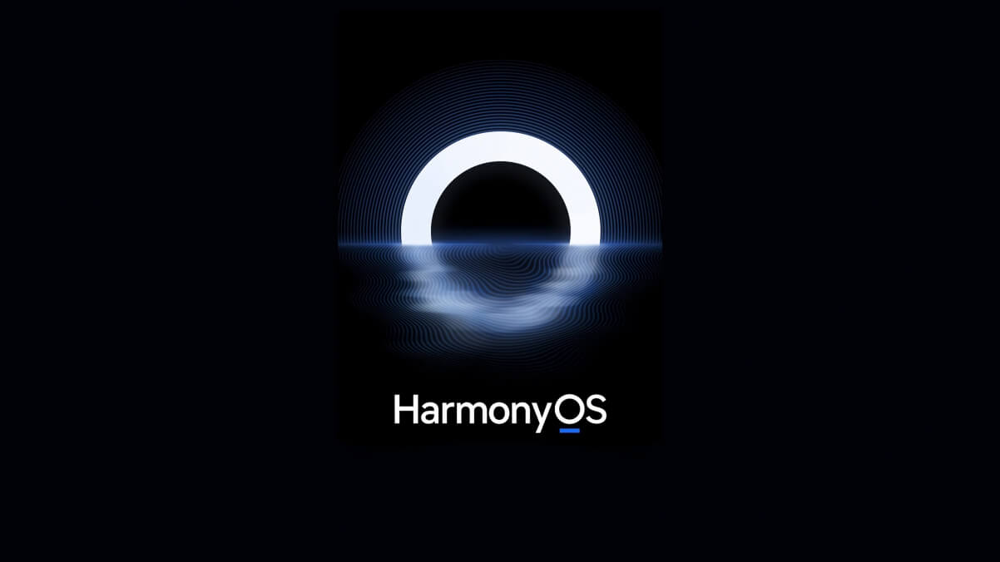

---
sidebar:
 title: css 利用filter（滤镜）&SVG动效实现会动的鸿蒙Logo
 step: 10
isTimeLine: true
title: css 利用filter（滤镜）&SVG动效实现会动的鸿蒙Logo
date: 2024-03-06 15:00:00
author: 马凯
tags:
 - 前端
 - JavaScript
 - demo
categories:
 - 前端
---

# css 利用filter（滤镜）&SVG动效实现会动的鸿蒙Logo

这是鸿蒙的宣传Logo

从图中分析能够直到上下对称，但是下边有水波效果；

## 复现效果

:::demo
css/ripples.vue
:::

## 知识点罗列

* [filter - 滤镜](https://developer.mozilla.org/zh-CN/docs/Web/CSS/filter)
* [repeating-radial-gradient - 重复渐变色](https://developer.mozilla.org/zh-CN/docs/Web/CSS/gradient/repeating-radial-gradient)
* [mask - 剪裁遮罩](https://developer.mozilla.org/zh-CN/docs/Web/CSS/mask)
* [svg-filter - 滤镜操作容器](https://developer.mozilla.org/zh-CN/docs/Web/SVG/Element/filter)

## 参考文档

* [震惊！巧用 SVG 滤镜还能制作表情包？](https://github.com/chokcoco/iCSS/issues/107)
* [实现一个会动的鸿蒙 LOGO](https://www.cnblogs.com/coco1s/p/16580595.html)
* [有意思！强大的 SVG 滤镜](https://github.com/chokcoco/cnblogsArticle/issues/27)
