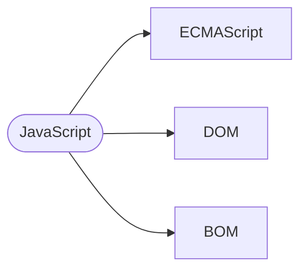
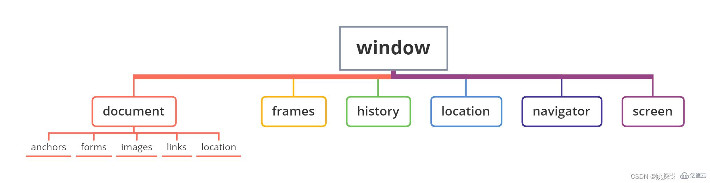
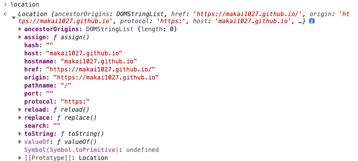
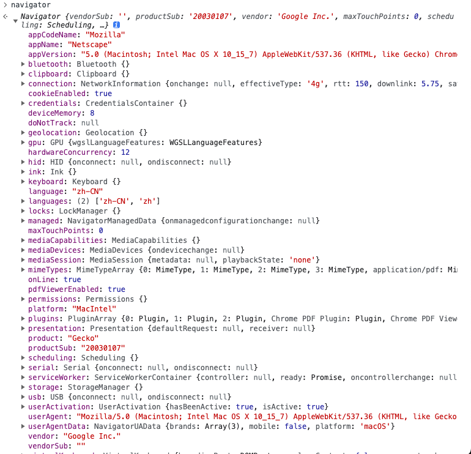
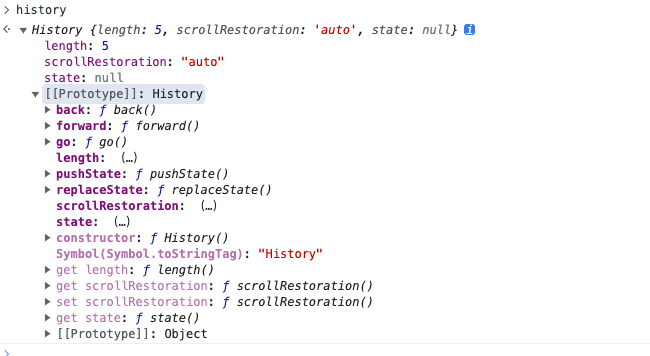

--- 
siderbar: 
    title: BOM是什么？常见的BOM对象有哪些？
isTimeLine: true
title: BOM是什么？常见的BOM对象有哪些？
date: 2020-6-15 09:40:00
author: 马凯
tags:
 - 前端
 - JavaScript
categories:
 - 前端
---

# BOM是什么？常见的BOM对象有哪些？


## 前提
在先了解BOM之前，先不充一下JavaScript整体结构。



从图中能够看出四个元素的关系

> **JavaScript包含了ECMAScript、BOM、DOM**。


### ECMAScript
> **ECMAScript 是一种由 ECMA国际（前身为欧洲计算机制造商协会）通过 ECMA-262 标准化的脚本程序设计语言，它是JavaScript（简称JS）的标准，浏览器就是去执行这个标准。**<br/>
> **ECMAscript更像一个规定，规定了各个浏览器怎么样去执行JavaScript的语法**

### DOM
> **DOM（Document Object Model ，文档对象模型）一种独立于语言，用于操作xml，html文档的应用编程接口。**<br/>
> **对于JavaScript：为了能够使JavaScript操作Html，JavaScript就有了一套自己的DOM编程接口。**

## BOM是什么？
> **BOM 是 Browser Object Model，浏览器对象模型。BOM 是为了控制浏览器的行为而出现的接口。**<br/>
> **对于JavaScript：为了能够让JavaScript能控制浏览器的行为，JavaScript就有了一套自己的BOM接口。**

用户的常规交互行为例如点击页面前进、后退、刷新、浏览器窗口事件、滚动条滚动等，都属于BOM对象。

BOM浏览器模型，包含了五大模块：
* **window**
* **navigator**
* **location**
* **screen**
* **history**

**BOM的梳妆结构模型**


## window 

在浏览器中，window对象有双重角色，即是浏览器窗口的一个接口，又是全局对象

因此所有在全局作用域中声明的变量、函数都会变成window对象的属性和方法.

例如
```js
// eslint-disable-next-line no-var
var name = '我是全局声明的'

function foo() {
  console.log(this.name)
}

console.log(window.name) // 我是全局声明的
foo() // 我是全局声明的
window.foo() // 我是全局声明的
```

### window 对象的常用方法和属性

|名称 | 类型 |方法|
| -- | -- | -- |
| opener | 属性 | 获取当前窗口的父窗口, 一般用于iframe|
| open(url, name, [options]) | 方法 | 打开执行页面 | 
| setTimeout(fn, delay) | 方法 | 定时器 |
| setInterval(fn, delay) | 方法 | 循环定时器 |
| requestAnimationFrame(callback) | 方法 | 利用workers实现帧动画，一般用于动画重绘 |
| clearTimeout(timer) | 方法 | 清除定时器 | 
| clearInterval(timer) | 方法 | 清除循环定时器 |
| close | 方法 | 主动关闭窗口 |
| alert(message) | 方法 | 浏览器主动提示 | 
| confirm(message) | 方法 | 弹出确认框 |
| onhashchange | 方法 | 用于监听浏览器hash变化|


### location对象的常用方法和属性
在浏览器中打印location可以看到一下信息；


|名称 | 类型 |方法|
| -- | -- | -- |
| hash | 属性 | 获取当前页面hash值，一般用于SPA页面|
| host | 属性 | 获取当前页面的host，也就是域名|
| hostname | 属性 | 获取当前页面的host，也就是域名|
| href | 属性 | 获取当前窗口地址 | 
| origin | 属性 | 获取当前窗口主域名 | 
| pathname | 属性 | 获取窗口页面路径名称 | 
| protocol | 属性 | 获取当前域名的协议 |
| reload | 方法 | 重载当前页面 |
| replace(url)| 方法 | 重定向页面 |


### navigator对象的属性和方法

在浏览器内打印navigator可以看到一下信息；



### history对象的方法和属性

在浏览器中打印history可以看到一下信息；


常用方法以及属性如下，history对象内的属性和方法是各大框架实现router监听的途径；

history路由模式主要是利用pushState、popState、replaceState
hash路由模式则是主要依靠onhashchange以及location.hash，实现hash变化监听

|名称 | 类型 |方法|
| -- | -- | -- |
| back | 方法 | 浏览器访问记录返回上一页 |
| go(delta) | 方法 | 访问记录，向前后者向后移动多少个 |
| forward() | 方法 | 向前移动一个记录 |
| pushState(state, unused, url) | 方法 | 该方法向浏览器的会话历史栈增加了一个条目，用于页面跳转回调 |
| replaceState(stateObj, title[, url]); | 方法 | 页面重定向回调 |


## 参考

* [JavaScript中DOM与BOM的区别与用法是什么](https://www.yisu.com/zixun/692555.html)