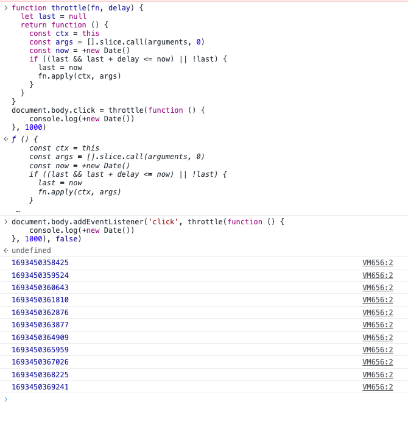
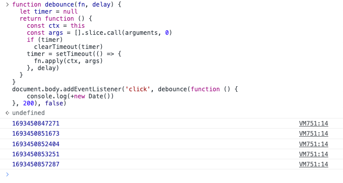

--- 
siderbar: 
    title: 什么是节流和防抖？他们的区别是什么？如何实现？
isTimeLine: true
title: 什么是节流和防抖？他们的区别是什么？如何实现？
date: 2020-10-13 10:00:00
author: 马凯
aside: true
tags:
 - 前端
 - JavaScript
categories:
 - 前端
---

# 什么是节流和防抖？他们的区别是什么？如何实现？

## 什么是节流和防抖

节流和防抖是前端开发工作中常用的优化执行频率的手段。

通过控制触发频率来达到优化的效果。

**节流throttle**： 单位时间内只执行一次，重复执行需要等待一定的间隔时间，再回执行第二次;重点是每次执行都至少间隔相同的delay时间。

下图可以很好地描述throttle，图片来源百度


**防抖debounce**：单位时间后执行，单位时间内重复执行，则重新计时。

防抖的目的在于防止单位时间内重复执行

## 节流和防抖的异同点

### 相同点
* 目的都是控制触发频率

### 不同点
核心区别点在于控制的频率不同

* 节流throttle，单位（delay）时间内只能执行一次，下次执行至少间隔delay ms，一般用于防止重复提交
* 防抖debounce，单位时间后执行，重复执行n次，只有最后一次有效

## 简单实现

### throttle
> **只需要记住一个要点，至少间隔单位时间，才能执行下一次**
```ts
function throttle(fn, delay) {
  let last = null
  return function () {
    const ctx = this
    const args = [].slice.call(arguments, 0)
    const now = +new Date()
    if ((last && last + delay <= now) || !last) {
      last = now
      fn.apply(ctx, args)
    }
  }
}
```

测试结果



### debounce
> **要点-单位时间后执行，单位时间内重复执行，则重新倒计时**

```ts
function debounce(fn, delay) {
  let timer = null
  return function () {
    const ctx = this
    const args = [].slice.call(arguments, 0)
    if (timer)
      clearTimeout(timer)
    timer = setTimeout(() => {
      fn.apply(ctx, args)
    }, delay)
  }
}
```
测试结果



## 使用场景
**debounce**
* 输入框输入内容检索，如果不设置防抖，一定会出现大量的请求，或者无用的回调
* dom宽高变化，产生的回调也是需要通过debounce控制因为只有最后一次有效


**throttle**
* 按钮防重复提交
