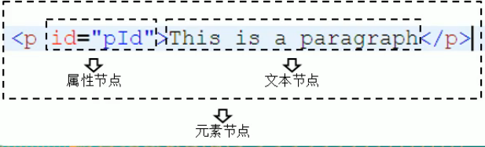

---
sidebar:
 title: JS中dom操作有哪些方法？
 step: 10
isTimeLine: true
title: JS中dom操作有哪些方法？
date: 2020-06-14
tags:
 - 前端
 - JavaScript
categories:
 - 前端
---

# JS中dom操作有哪些方法？

## 什么是dom元素？ 什么是节点？

**Dom全称为Document Object Model，文档对象模型。**
文档表示整个html文档；
对象表示将网页中的每一个元素转化为一个对象；
模型是用来描述对象之间的关系DOMtree，方便获取DOM对象；

**节点：网页中每一个标签都称为节点**

* 文档节点表示：整个HTML文档，一个页面就是一个文档；
* 元素（也称为标签）节点： html中的所有html标签
* 属性节点： 元素的属性例如input的 value属性
* 文本节点：html标签中的文本

详情图解：

## dom节点的增加
| 方法 | 描述 | 
| ---- | ---- |
|父节点.appendChild|向父节点内添加一个dom|
|父节点.insertedBefore(targetDom, newDom)|在targetDom前新增一个节点newDom|
|父节点.insertedAfter(targetDom, newDom)|在targetDom后新增一个节点newDom|

## dom节点的删除
| 方法 | 描述 | 
| ---- | ---- |
|父节点.removeChild(targetDom)|父节点将targetDom 删除|
|targetDom.remove()|targetDom 删除自身|
|a.replaceChild(b,c)|：用b替换c,例如document.body.replaceChild(a,b) |
|a.replaceWith(b)|使用b替换a， oldDom.replaceWith(newDom)|

## dom节点的更新或者修改属性
| 方法 | 描述 | 
| ---- | ---- |
|父节点.innerText = xxx|父节点修改内部文本，也可以通过将innerText设置为''达到删除的效果， 没有设置=则是获取|
|父节点.innerHtml|获取父节点内部的文本内容，如果设置=则是将内部html或者文本进行替换|
|dom.getAttribute|获取dom的所有属性|
|dom.setAttribute|dom设置属性|
|dom.removeAttribute|dom移除指定属性|

## dom节点的查找
| 方法 | 描述 | 
| ---- | ---- |
|父节点.querySelector|获取匹配节点的第一个，接收一个class/id/tagName/name|
|父节点.querySelectorAll|获取匹配的所有节点，接收一个class/id/tagName/name， 返回一个NodeList伪数组|
|父节点.getElementById|根据dom的id查找真实dom对象|
|父节点.getElementsByClassName|根据dom的class信息查找真实dom对象，返回一个HtmlCollection伪数组|
|父节点.getElementsByTagName|根据标签名称查找对应的真实dom，返回一个HTMLCollection伪数组|
|父节点.getElementsByName|根据节点的属性名称name，获取对应的真实dom对象列表，返回一个NodeList伪数组|
|parentNode|获取父节点dom,返回html对象|
|document.forms|获取文档内所有的表单, 返回一个HTMLCollection伪数组|
|window.frames|返回所有的iframe标签，返回window对象|
|父节点.previousSibling|获取节点的前一个兄弟节点|
|父节点.nextSibling|获取节点的后一个兄弟节点|
|父节点.childNodes|返回父节点下的所有NodeList元素|
|父节点.firstChild|获取节点的第一个子节点|
|父节点.lastChild|获取节点的最后一个子节点|

## dom节点的创建
| 方法 | 描述 | 
| ----: | ----: |
|document.createElement|创建节点|
|document.createTextNode|创建node|
|document.createDocumentFragment|创建空白文档|
|dom.cloneNode()|将dom克隆一个新的dom|

## HTMLCollection和NodeList

### 相同点
* NodeList 和 HTMLCollection都是非数组，属于类数组或者伪数组
* 都存在length属性
* 都可以通过索引获取对应的元素
* 都无法使用数组的方法，valueOf、pop、push、join

### 区别

* HTMLCollection是html元素的集合（仅包含元素）
* NodeList是文档节点的集合
* NodeList只能通过索引来获取
* NodeList包含文本节点和属性节点
* HTMLCollection可以通过name、id或或者索引来获取

### 获取NodeLit的方法

* document.getElementsByName
* document.querySelectorAll
* element.childNodes

### 获取HTMLCollection的方法

* document.getElementsByClassName
* document.getElementsByTagName
* document.forms