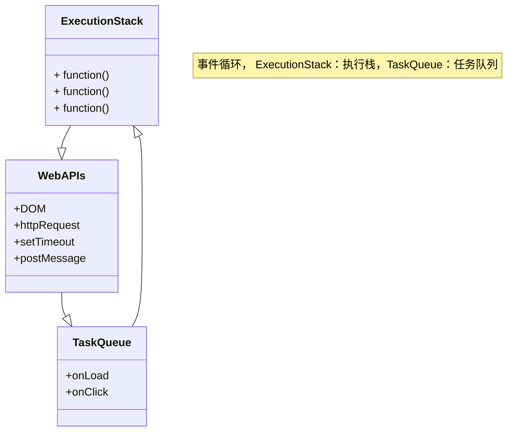
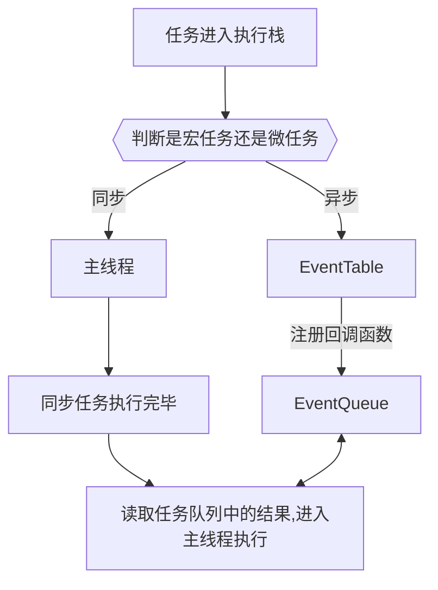
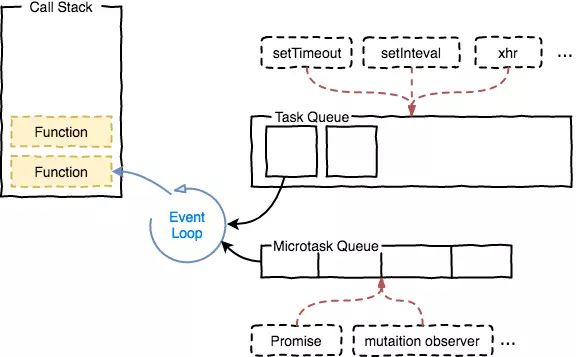
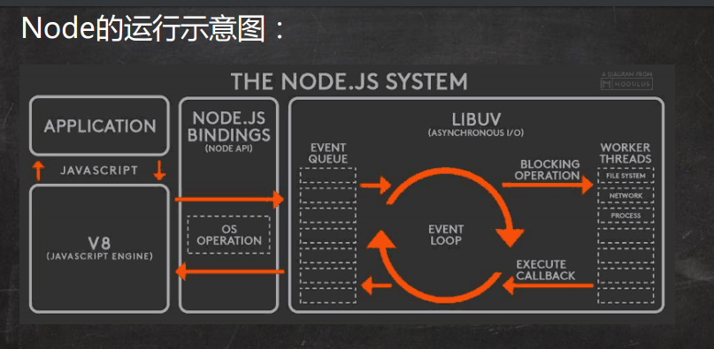
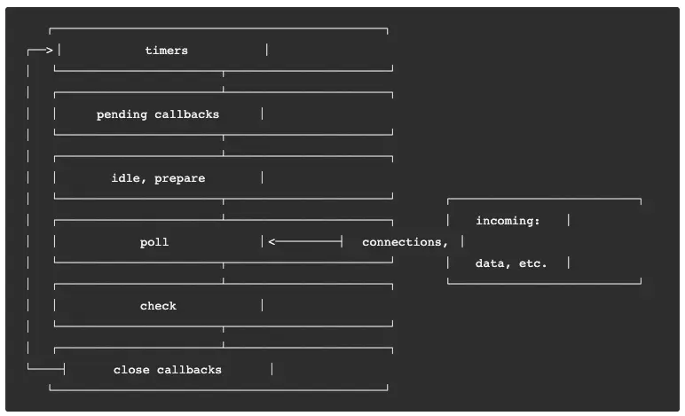
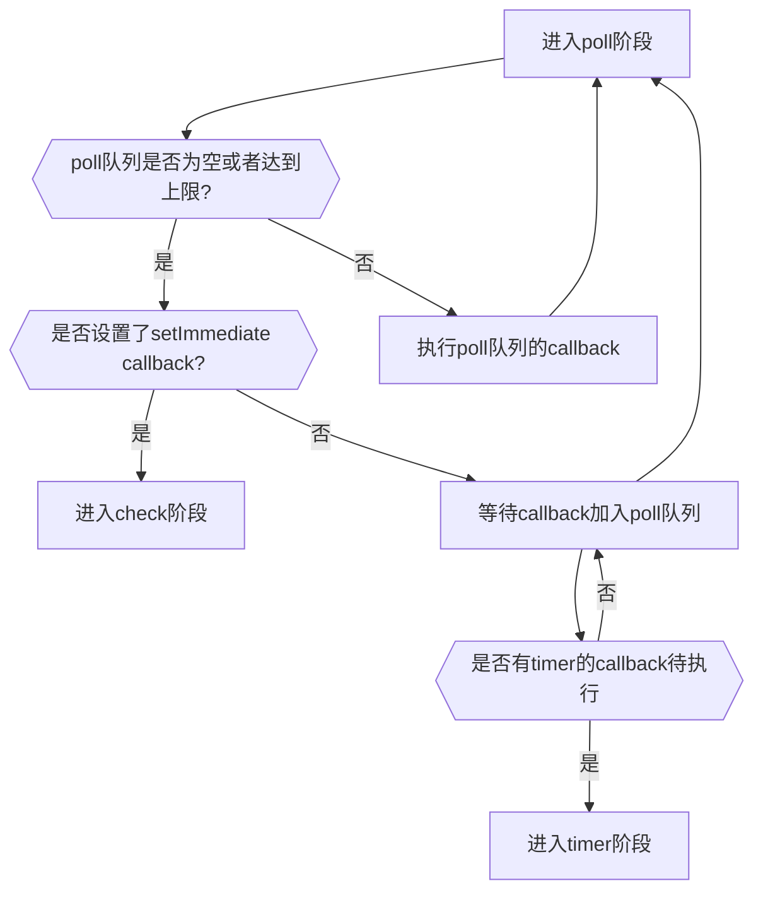
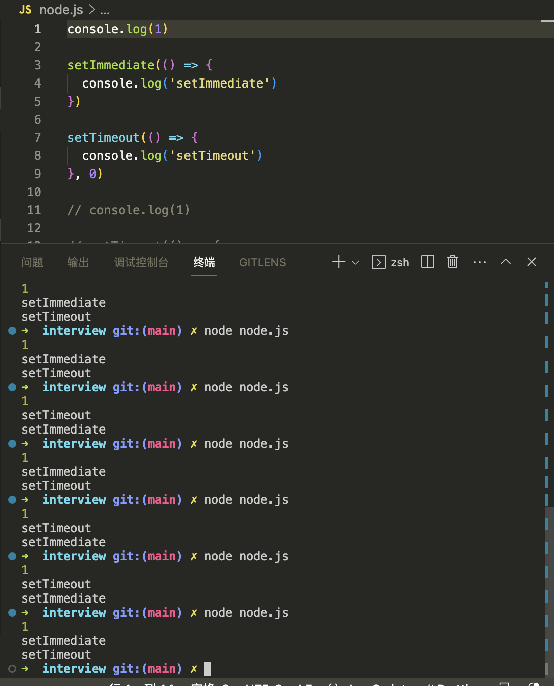

--- 
mermaidTheme: forest
siderbar: 
    title: JavaScript-事件循环（EventLoop）
isTimeLine: true
title: JavaScript-事件循环（EventLoop）
date: 2020-05-15 10:00:00
author: 马凯
aside: true
tags:
 - 前端
 - JavaScript
categories:
 - 前端
---

# JavaScript-事件循环（EventLoop）

## 什么是事件循环，为什么要使用事件循环？

> JavaScript事件循环是异步事件和回调函数的处理方式，它是实现异步编程的核心。当JS在浏览器或者nodeJS执
>行时，事件循环用于任务队列和调用栈管理，方便在适当的时候进行调用。

**JS事件处理属于单线程的，主要原因在于不能一边删除dom，一遍添加dom，要控制先后顺序，事件循环就是处理单线程队列阻塞和管理事件调用机制的方式，所以JS的事件只能按照调用的顺序执行。**

**这里说的JS单线程是指JavaScript引擎的线程，是指负责执行JS语法的主线程。该线程与浏览器GUI引擎的线程是互斥的，互斥的原因在于JS引擎操作dom，GUI用户渲染dom，如果他们同时进行，就会造成混乱，不清楚最终需要渲染哪一个dom。如此设计的后果就是如果JS长时间执行没有结果，则会造成GUI不渲染，也就是页面白屏，所以while(true)如果没有break是绝对不允许的。**


> JS 事件类型分为同步任务和异步任务，异步任务又分为宏任务和微任务。<br/>同步任务是连贯性执行；<br/>异步任务，不是连续执行的而是先执行一段，等待事件准备完毕，再回头执行第二段，第二段也叫做回调；

JS异步的实现靠的就是浏览器的多线程，当遇到异步任务时，将这个任务交给对应的线程处理，当该异步任务满足回调条件时，对应的线程又通过事件触发线程将这个回调事件存放到任务队列内，主程序从任务队列取出事件继续执行。


## 同步任务和异步任务

> **同步任务：**在主线程上排队进入执行栈，只有前一个任务执行完毕，才会执行下一个任务，按照读取顺序执行；


> **异步任务：**异步任务被读取后不会立即放入执行队列，而是进入任务队列等待执行结果，只有任务队列获取到异步任务的执行结果才会推入执行栈执行



任务队列**TaskQueue**，即队列，是一种先进先出的一种数据结构



### 看一下简单的执行顺序
```ts
function syncFn() {
  const time = +new Date()
  while (true) {
    if (+new Date() - time > 2000)
      break

  }

  console.log(2)
}

console.log(1)
syncFn()

console.log(3)

// 执行结果：上述代码会先打印出1，然后调用syncFn，syncFn内部会等待2s，然后打印2，最后打印3。整个打印顺序跟代码书写顺序一致，所以以上是同步代码。
```


**举例异步任务**
```ts
function syncFn() {
  setTimeout(() => {
    console.log(2)
  }, 2000)
}
console.log(1)
syncFn()
console.log(3)

// 执行结果：1,3，等待2s后，打印2，这就体现了我们对事件循环的解释，同步任务先行，异步任务存放到对应队列后等待执行结果
```


## 异步任务分类

:::tip
Promise的声明本身是同步，只有他的resolve和catch是异步的！！！
:::

异步任务又分为：**宏任务队列**和**微任务队列**，JavaScript引擎在读取到JS时，先生成一个全局执行上下文，按照读取顺序将同步任务推入全局执行上下文执行，遇到异步任务，根据微任务和宏任务的区别，分别存放到微任务队列（micro-task）和宏任务队列（macro-task）


**宏任务包括**：setTimeout、setInterval、setImmediate（node环境）、requestAnimationFrame、I/O、UIrender、http请求、postMessage

**微任务队列**：Promise.then、promise.catch、mutationObserver（dom更新检测回调）、process.nextTick(node端)、async/await


## EventLoop任务执行顺序


### 浏览器EventLoop

> 1. 浏览器在执行第一个js之后，会在生成一个全局执行上下文，同时声明一个执行栈，js文本从上到下开始将同步任务推到执行栈执行，遇到异步任务，则按照异步任务类型将异步任务推到微任务队列和宏任务队列
> <br/>
> 2. 当所有的微任务执行完毕之后开始从宏任务队列中取一个宏任务放入执行栈，该宏任务执行完毕之后，再去检查微任务队列，
> <br/>
> 3. 重复以上步骤直到所有的任务执行结束

**执行流程图解**


:::tip
注意📢：
1. 一个EventLoop可以有多个事件队列，但是只能有一个微任务队列
2. 微任务队列全部执行完毕会重新渲染一次
3. 每一个宏任务执行完毕都会重新渲染一次
4. requestAnimationFrame处于渲染阶段时，既不属于红任务也不属于微任务。
:::

## 宏任务setTimeout的理解误区

setTimeout的回调函数不一定在指定时间后一定执行，而是在指定时间后，将回调函数放入事件循环的宏任务队列内；

如果说延时时间到了之后，JS引擎还在执行同步任务，或者还在执行微任务，这个回调函数就需要等待，如果当前宏任务队列还有其他的任务，在队列前边待执行，那么也是需要等待的；


另外，setTimeout 第二个参数也就是delay时间，如果不写则默认是4ms；

按照以上的思路，我们写个例子。

```ts
function syncFn(startTime) {
  console.log('调用同步任务', startTime)
  const time = +new Date()
  while (true) {
    if (+new Date() - time > 5000)
      break
  }

  const subTime = +new Date() - startTime

  console.log(`同步任务执行时间差：${subTime}ms`)
}

function asyncFn(startTime) {
  console.log('调用异步任务', startTime)
  setTimeout(() => {
    const subTime = +new Date() - startTime
    console.log(`异步任务执行时间差：${subTime}ms`)
  }, 2000)
}

const startTime = +new Date()
// 让异步任务先被读取，存放到宏任务队列
asyncFn(startTime)
// 在读取同步任务，放入全局执行上下文执行
syncFn(startTime)

// 打印结果
// 调用异步任务 1691990635585
// 调用同步任务 1691990635585
// 同步任务执行时间差：5001ms
// 异步任务执行时间差：5003ms
```

> 从以上结果可以看出，虽然我们先调用的宏任务setTimeout，也写了在2s后打印执行结果，但是因为同步任务syncFn执行时间过长，导致在2s后，异步任务已经在队列中等待执行了，因为全局执行上下文中有一个正在执行的同步任务。**这里也提示各位，一定要注意代码不要占用主执行栈太长时间。**


## NodeJs 中的EventLoop



Node中的EventLoop是基于libuv实现的，而libuv是Node的新跨平台抽象层，libuv使用异步，事件驱动的编成方式，核心提供I/O的事件循环和异步回调。以下是Node端EventLoop的各个阶段：



node的EventLoop一共有六个阶段，每一个阶段细节如下：
* **timers**: 执行setTimeout和setInterval中的待执行回调函数callbacks
* **pending Callback**: 上一轮循环中少数的callback会放在该阶段执行
* **idel,prepare**: 仅在内部使用
* **poll**: 最重要的阶段，执行pending callback，在适当的情况下会阻塞在这个阶段。
* **check**: 执行setImmediate(setImmediate是将事件插入到事件队列尾部主线程和事件队列的函数执行完之后立即执行setImmediate指定的回调函数)的callback
* **close callback**： 执行close事件的callback，例如socket.on('close', [,fn])或者http.server.on('close',[,fn])


每一个阶段都有自己先进先出的任务队列，只有当这个队列的事件执行完毕或者达到该阶段的上限时，才会进入下一个阶段。在每次事件循环阶之间都会检查是否等待任何一个IO或者定时器，如果没有，则程序退出；

还有个需要注意的是poll阶段，**它后面并不一定每次都是check阶段，poll队列执行完后**，如果没有setImmediate但是有定时器到期，他会绕回去执行定时器阶段：




## setImmediate和setTimeout到底谁先执行？

> 通过上方的流程图，我们可以清晰地看到，在一个异步流程内，setImmediate会比setTimeout先执行，我们通过代码测试一下。

```ts
console.log(1)

setTimeout(() => {
  setTimeout(() => {
    console.log('setTimeout')
  }, 0)

  setImmediate(() => {
    console.log('setImmediate')
  }, 0)
}, 0)

// 执行结果
// 1
// setImmediate
// setTimeout
```

如上图释义的一样，setTimeout的回调函数内，setImmediate先执行了，分析流程如下：
> 1. 同步任务console.log1先执行<br/>
> 2. 然后执行setTimeout，等待其可执行时，刚好处于timers阶段<br/>
> 3. 当执行第一个外层setTimeout回调时，遇到第二个setTimeout，那么该setTimeout会在下次的timers阶段执行<br/>
> 4. 再继续处理到setImmediate时，将它加入到check阶段的队列中<br/>
> 5. 第一个setTimeout在本次timers阶段执行完毕，进入pending callback -> idle -> prepare -> poll,这几个阶段的队列都是空，所以自然进入了下一个阶段check<br/>
> 6. 当进入check阶段时，检查队列中有一个setImmediate回调，按顺序执行该回调<br/>
> 7. 然后进入close callback阶段，再次检查timers队列，发现存放了setTimeout callback，也就是第二个setTimeout，执行该setTimeout的回调函数

**如果说不用setTimeout包裹setTimeout、setImmediate那么它们的执行顺序将不会是固定的。**

```ts
console.log(1)

setTimeout(() => {
  console.log('setTimeout')
}, 0)

setImmediate(() => {
  console.log('setImmediate')
}, 0)
```
多次执行会发现可能是setTimeout先执行，也可能是setImmediate先执行，结果如图：



:::tip
在nodejs中，setTimeout(fn, [,delay]) delay参数会被强制更改为1，[官方解释](https://link.segmentfault.com/?enc=nwZ7ZHLLaubbSaeDQkUOgg%3D%3D.k0fJ5nqSx3PfXyG7pCGbpk%2Bs1CHMXOvwUaaTpophJIQ2CNVi4LZVI5xfCmyZC8UKECRvH1TTDI5OSA54TdJZzpvlRmh4dy48FpcWWP6XRY8%3D),setTimeout在html中默认最小delay时间是4ms
:::

根据上述要点，分析流程如下：
> 1. 外层同步代码一次性全部执行完，遇到异步API就塞到对应的阶段
> 2. 遇到setTimeout，虽然设置的是0毫秒触发，但是被node.js强制改为1毫秒，塞入times阶段
> 3. 遇到setImmediate塞入check阶段
> 4. 同步代码执行完毕，进入下一次Event Loop
> 5. 先进入times阶段，检查当前时间过去了1毫秒没有，如果过了1毫秒，满足setTimeout条件，执行回调，如果没过1毫秒，跳过
> 6. 跳过空的阶段，进入check阶段，执行setImmediate回调


通过上述流程的梳理，我们发现关键就在这个1毫秒，如果同步代码执行时间较长，进入Event Loop的时候1毫秒已经过了，setTimeout执行，如果1毫秒还没到，就先执行了setImmediate。每次我们运行脚本时，机器状态可能不一样，导致运行时有1毫秒的差距，一会儿setTimeout先执行，一会儿setImmediate先执行。但是这种情况只会发生在还没进入timers阶段的时候。像我们第一个例子那样，因为已经在timers阶段，所以里面的setTimeout只能等下个循环了，所以setImmediate肯定先执行。同理的还有其他poll阶段的API也是这样的，比如：

```ts
const fs = require('node:fs')

fs.readFile(__filename, () => {
  setTimeout(() => {
    console.log('setTimeout')
  }, 0)
  setImmediate(() => {
    console.log('setImmediate')
  })
})
```


这里setTimeout和setImmediate在readFile的回调里面，由于readFile回调是I/O操作，他本身就在poll阶段，所以他里面的定时器只能进入下个timers阶段，但是setImmediate却可以在接下来的check阶段运行，所以setImmediate肯定先运行，他运行完后，去检查timers，才会运行setTimeout。

```ts
console.log('1')

setImmediate(() => {
  setTimeout(() => {
    console.log('setTimeout')
  }, 0)
  setImmediate(() => {
    console.log('setImmediate')
  })
})
```

原因跟写在最外层差不多，因为setImmediate已经在check阶段了，里面的循环会从timers阶段开始，会先看setTimeout的回调，如果这时候已经过了1毫秒，就执行他，如果没过就执行setImmediate。

## process.nextTick()

process.nextTick()是一个特殊的异步API，他不属于任何的Event Loop阶段。事实上Node在遇到这个API时，Event Loop根本就不会继续进行，会马上停下来执行process.nextTick()，这个执行完后才会继续Event Loop。我们写个例子来看下：

```ts
const fs = require('node:fs')

fs.readFile(__filename, () => {
  setTimeout(() => {
    console.log('setTimeout')
  }, 0)

  setImmediate(() => {
    console.log('setImmediate')

    process.nextTick(() => {
      console.log('nextTick 2')
    })
  })

  process.nextTick(() => {
    console.log('nextTick 1')
  })
})
// 执行结果如下
// nextTick 1
// setImmediate
// nextTick 2
// setTimeout
```
流程分析：
> 1. 我们代码基本都在readFile回调里面，他自己执行时，已经在poll阶段
> 2. 遇到setTimeout(fn, 0)，其实是setTimeout(fn, 1)，塞入后面的timers阶段
> 3. 遇到setImmediate，塞入后面的check阶段
> 4. 遇到nextTick，立马执行，输出'nextTick 1'
> 5. 到了check阶段，输出'setImmediate',又遇到个nextTick,立马输出'nextTick 2'
> 6. 到了下个timers阶段，输出'setTimeout'

这种机制其实类似于我们前面讲的微任务，但是并不完全一样,比如同时有nextTick和Promise的时候，肯定是nextTick先执行，原因是nextTick的队列比Promise队列优先级更高。来看个例子:

```ts
const promise = Promise.resolve()
setImmediate(() => {
  console.log('setImmediate')
})
promise.then(() => {
  console.log('promise')
})
process.nextTick(() => {
  console.log('nextTick')
})

// 执行结果
// nextTick
// promise
// setImmediate
```


## 参考文档
* [面试之 Event Loop，nextTick() 和 setImmediate() 区别分析](https://www.wenjiangs.com/article/tzzt0cny.html)
* [setTimeout和setImmediate到底谁先执行，本文让你彻底理解Event Loop](https://segmentfault.com/a/1190000023315304)
* [JS中的宏任务和微任务的区别和用法](https://www.cnblogs.com/gxw123/p/13301687.html)