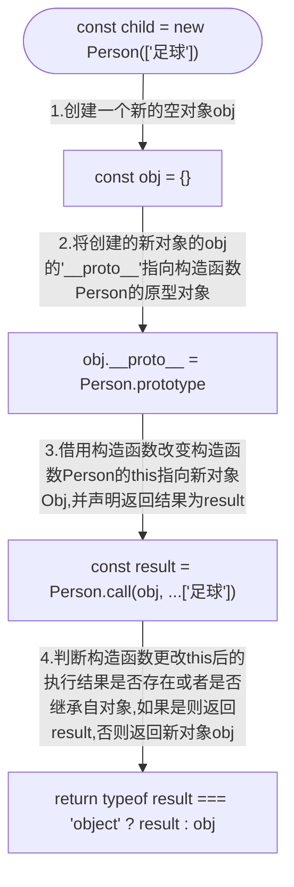

---
sidebar:
 title: new操作具体做了什么？
 step: 10
isTimeLine: true
title: new操作具体做了什么？
date: 2020-08-20
author: 马凯
tags:
 - 前端
 - JavaScript
categories:
 - 前端
---

# new操作具体做了什么？

> **new 方法是用于构造函数实例化的方法，所有的构造函数都可以通过new进行创建实例。**


## new 操作解析

例子
```ts
function Person(hobbys = []) {
  // 实例 引用数据类型属性
  this.hobbys = hobbys
}
// 原型链方法
Person.prototype.say = function () {
  console.log(this.hobbys)
}

const child = new Person(['足球'])

console.log(child) // Person { hobbys: ['足球'] }
console.log(child.__proto__) // { say: function(){}, constructor:  }
console.log(child.__proto__ === Person.prototype) // true
child.say() // ['足球']

console.log(typeof child) // object
```

通过以上例子可以发现，new 创建的实例，继承了构造函数Person的实例属性和原型链方法。
实例child的原型链指向构造函数Person的prototype。


## new 执行过程解析

1. 创建一个空对象Object
```js
const obj = {} // 底层原理实际是 new Object({})
console.log(`第一步,${obj}`) // obj的原型对象内的constructor指向Object
```

2. 给新建的对象obj新增__proto__属性，指向构造函数Person的原型对象
```js
obj.__proto__ = Person.prototype
console.log(`第二步,${obj}`) // 返回Person的原型对象，内部constructor指向Person
```

3. Person通过借用构造函数方法（call、apply）为obj新增hobbys的属性

```js
Person.call(obj, ['足球'])
console.log(`第三步,${obj}`) // 返回Person的原型对象，新增了一个实例属性hobbys
```

## 如果构造函数Person 本身有返回，又会是什么结果呢？

例子

```js
function Foo(name) {
  this.name = name
  return {
    value: 111
  }
}

function Boo(name) {
  this.name = name
  return name
}

const testA = new Foo('你好Foo')
console.log(testA) // { value: 111 }
console.log(testA.name) // undefined,这就神奇了！！！

const testB = new Boo('你好Boo')
console.log(testB) // Boo { name: '你好Boo' }
console.log(testB.name) // 你好Boo
```

通过返回结果可知，如果说构造函数本身有返回，如果返回的结果是object，那么实例化后则直接返回object；
如果构造函数默认返回的是基础数据类型或者不返回，则返回构造函数原型对象；

所以，new过程解析中的第三步也就是借用构造函数返回时，需要对借用构造函数的返回结果进行判断，是返回**借用构造函数的返回结果**，还是直接返回**新对象**。


## 整体流程图示




## 手写模拟new

:::tip
注意：在构造函数没有返回值的情况下，直接返回创建的新对象；<br/>
我们先假定 构造函数通过借用构造函数更改作用域指向后的执行结果为result;<br/>
如果构造函数有返回，这个时候需要判断返回值的数据类型；<br/>
如果返回值result为基础数据类型string、number、null、undefined、boolean、symbol，那么返回新对象；<br/>
如果返回值为引用数据类型时，则返回result
:::

```ts
function _new(constructor) {
  const args = [].slice.call(arguments, 1)
  // 定义新对象
  const obj = {}
  // 添加新对象的__proto__指向构造函数constructor的prototype
  obj.__proto__ = constructor.prototype
  // 借用构造函数更改constructor的this指向，并记录返回结果
  const result = constructor.apply(obj, args)
  // 返回时判断result是否为object, 这里为什么要用instanceof而不是typeof主要是判断继承关系
  // typeof判断function结果为function，instanceof判断[]/{}/function等等都是继承自Object
  return result instanceof Object ? result : obj
}
```

**测试可用性**
```js
function Person(hobbys = []) {
  // 实例 引用数据类型属性
  this.hobbys = hobbys
}
// 原型链方法
Person.prototype.say = function () {
  console.log(this.hobbys)
}

const child = _new(Person, ['足球'])

console.log(child) // Person { hobbys: ['足球'] }
console.log(child.__proto__) // { say: function(){}, constructor:  }
console.log(child.__proto__ === Person.prototype) // true
child.say() // ['足球']
console.log(child instanceof Person) // true
console.log(typeof child) // object
```
