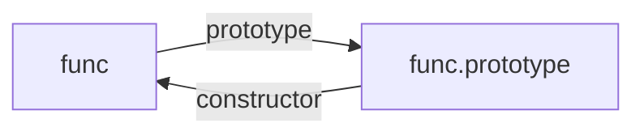
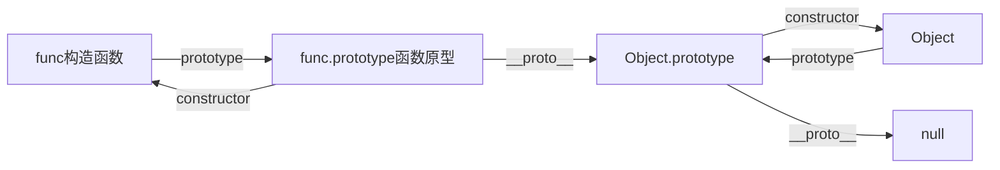
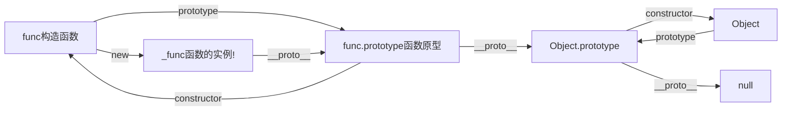

---
sidebar:
 title: JS中原型和原型链
 step: 10
isTimeLine: true
title: JS中原型和原型链
date: 2020-07-11
tags:
 - 前端
 - JavaScript
categories:
 - 前端
---

# JavaScript中的原型和原型链

## 原型

JavaScript是一种基于原型的语言，每一个构造函数都有一个原型对象。

每一个函数都有很多属性(name,length,constructor,prototype等),**但是有一个特殊的属性prototype，该属性指向原型对象**，包含两个属性constructor和[[prototype]]

prototype内部的[[prototype]]是prototype的原型对象

举个例子：

```ts
function func() {}
console.log(func.prototype)
```

控制台输出如下：
```ts
// func.prototype
{
    constructor: ƒ func(),
    [[prototype]]: { // 真实显示为[[prototype]]或者<prototype>
        constructor: ƒ Object(),
        hasOwnProperty: ƒ hasOwnProperty(),
        isPrototypeOf: ƒ isPrototypeOf(),
        propertyIsEnumerable: ƒ propertyIsEnumerable(),
        toLocaleString: ƒ toLocaleString(),
        toString: ƒ toString(),
        valueOf: ƒ valueOf(),
        __proto__: {
            constructor: ƒ Object(),
            hasOwnProperty: ƒ hasOwnProperty(),
            isPrototypeOf: ƒ isPrototypeOf(),
            propertyIsEnumerable: ƒ propertyIsEnumerable(),
            toLocaleString: ƒ toLocaleString(),
            toString: ƒ toString(),
            valueOf: ƒ valueOf(),
            __proto__: null
        }
    }
}

```
由console.log(func.prototype)的打印结果可以得知



## 原型链
JavaScript的每一个对象都有一个属性__proto__，这个属性指向的是该对象的原型。**除了null，null属于顶层原型**

当试图访问一个对象的属性时，JavaScript引擎不仅仅在该对象本身查找该属性，还会在对象的原型上，以及该对象原型的原型，依次层层查找，直到找到该属性或者找到原型链的末尾null，则停止。

该查找的过程中原型与原型的关系称之为原型链。

举个例子：

```ts
function func(name) {}

console.log(func.__proto__)
```
**返回结果**

> 我是用的火狐浏览器，谷歌浏览器func.__proto__打印不出来
```ts

// func.__proto__
{
    constructor: ƒ Function(),
    bind: f bind(),
    call: f call(),
    apply: f apply(),
    name: "",
    length: 0,
    [[prototype]]: { // 真实显示为[[prototype]]或者<prototype>
        constructor: ƒ Object(),
        hasOwnProperty: ƒ hasOwnProperty(),
        isPrototypeOf: ƒ isPrototypeOf(),
        propertyIsEnumerable: ƒ propertyIsEnumerable(),
        toLocaleString: ƒ toLocaleString(),
        toString: ƒ toString(),
        valueOf: ƒ valueOf(),
        __proto__: {
            constructor: ƒ Object(),
            hasOwnProperty: ƒ hasOwnProperty(),
            isPrototypeOf: ƒ isPrototypeOf(),
            propertyIsEnumerable: ƒ propertyIsEnumerable(),
            toLocaleString: ƒ toLocaleString(),
            toString: ƒ toString(),
            valueOf: ƒ valueOf(),
            __proto__: null
        }
    }
}
```
通过观察结果发现一个问题，func.__proto__指向的是Function的原型对象，那么func.prototype.__proto__不应该也是指向的Function的原型对象吗？？？

测试结果：
```ts
console.log(func.__proto__ === Function.prototype) // true
console.log(func.prototype.__proto__ === Function.prototype) // false
console.log(func.prototype.__proto__ === Object.prototype) // true
console.log(Function.prototype.__proto__ === Object.prototype) // true
console.log(Object.prototype.__proto__ === null) // true
```

> **有一点我有点疑惑，为什么函数func.prototype.__proto__不是指向Function，而是Object？**

通过以上测试结果可知,func的原型链关系图如下：



为了更全面的测试，引入构造函数实例。

```ts
function func() {}
const _func = new func()

console.log(_func.__proto__) //
console.log(_func.prototype) // undefined
```
> **为什么new 出来的新函数没有prototype？**

_func.__proto__的打印结果

```ts
{
    constructor: ƒ Func(),
    [[prototype]]: { // 真实显示为[[prototype]]或者<prototype>
        constructor: ƒ Object(),
        hasOwnProperty: ƒ hasOwnProperty(),
        isPrototypeOf: ƒ isPrototypeOf(),
        propertyIsEnumerable: ƒ propertyIsEnumerable(),
        toLocaleString: ƒ toLocaleString(),
        toString: ƒ toString(),
        valueOf: ƒ valueOf(),
        __proto__: {
            constructor: ƒ Object(),
            hasOwnProperty: ƒ hasOwnProperty(),
            isPrototypeOf: ƒ isPrototypeOf(),
            propertyIsEnumerable: ƒ propertyIsEnumerable(),
            toLocaleString: ƒ toLocaleString(),
            toString: ƒ toString(),
            valueOf: ƒ valueOf(),
            __proto__: null
        }
    }
}
```

通过以上测试结果可知,_func/func的原型链关系图如下：



***原型链关系流程分析***
* 函数func的属性prototype指向func的原型对象，就是func.prototype，只有函数本身才有原型对象，如果是new创建的实例只能通过__proto__查看继承关系，没有prototype
* 构造函数实例_func的__proto__指向构造函数func的原型对象，也就是func.prototype
* func.prototype.__proto__ 指向内置对象，因为 func.prototype 是个对象，默认是由 Object 函数作为类创建的，而 Object.prototype 为内置对象
* func.__proto__指向的内置匿名函数，因为func是一个函数，所以默认由Function作为构造函数创建，至于为什么func是一个构造函数，不是一个实例稍后解释
* Function.prototype 和 Function.__proto__ 同时指向内置匿名函数 anonymous，Function.prototype.__proto__指向内置对象Object.prototype,Object.prototype.__proto__指向的又是null，这样原型链的终点就是 null


### 总结

__proto__作为不同对象的链接关系，用来指向创建该对象的构造函数的原型对象。

每个对象的__proto__都是指向它的构造函数的原型对象prototype的

```ts
_func.__proto__ === func.prototype
```

构造函数是一个函数对象，是通过 Function 构造器产生的
```ts
func.__proto__ === Function.prototype
```

原型对象本身是一个普通对象，而普通对象的构造函数都是Object
```ts
func.prototype.__proto__ === Object.prototype
```

刚刚上面说了，所有的构造器都是函数对象，函数对象都是 Function 构造产生的
```ts
Object.__proto__ === Function.prototype
```

Object 的原型对象也有__proto__属性指向null，null是原型链的顶端
```ts
Object.prototype.__proto__ === null
```


* 一切对象都是继承自Object对象，Object 对象直接继承根源对象 null

* 一切的函数对象（包括 Object 对象），都是继承自 Function 对象

* Object 对象直接继承自 Function 对象

* Function对象的__proto__会指向自己的原型对象，最终还是继承自Object对象

## 引申问题

* 为什么函数func.prototype.__proto__不是指向Function，而是Object？
> 解释，因为函数func是Function的一个实例，所以func.__proto__指向的是Function，另外就是Function因为本身是一个函数所以实例化返回得也是一个函数，那么就造成了func.prototype.__proto__指向的是Object，而不是Function

* [为什么new 出来的新函数没有prototype？](./prototype2.md)

## 参考
* [JavaScript深入之从原型到原型链](https://github.com/mqyqingfeng/Blog/issues/2)
* [面试官：JavaScript原型，原型链 ? 有什么特点](https://github.com/febobo/web-interview/issues/59)