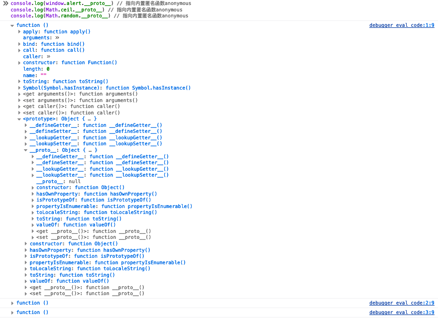
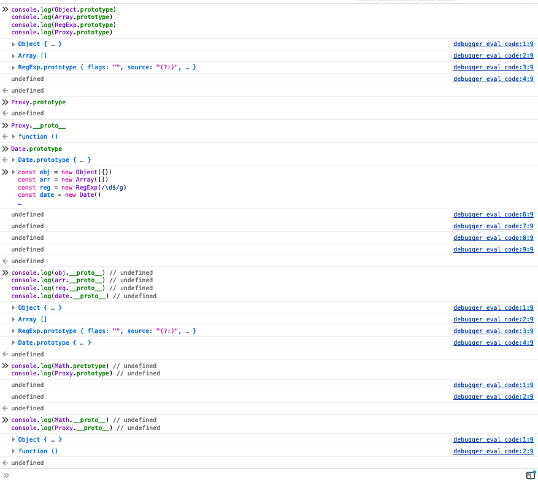

---
sidebar:
 title: javascript - 为什么实例没有prototype属性？什么时候对象会有prototype属性呢？
 step: 10
isTimeLine: true
title: javascript - 为什么实例没有prototype属性？什么时候对象会有prototype属性呢？
date: 2020-07-12
author: 马凯
tags:
 - 前端
 - JavaScript
categories:
 - 前端
---

# javascript - 为什么实例没有prototype属性？什么时候对象会有prototype属性呢？

## 代码示例

```ts
function Foo() {}

const test = new Foo()

console.log(test.prototype) // undefined
console.log(test.__proto__ === Foo.prototype) // true
```

## 解答

只有构造函数才有prototype属性，通常我们自定义的函数都属于构造函数，所以默认都有此属性。

JS运行时环境内置的函数有些不是构造函数，比如alert和Math.sqrt等，就没有此属性。

```ts
console.log(window.alert.prototype) // undefined
console.log(Math.ceil.prototype) // undefined
console.log(Math.random.prototype) // undefined

console.log(window.alert.__proto__) // 指向内置匿名函数anonymous
console.log(Math.ceil.__proto__) // 指向内置匿名函数anonymous
console.log(Math.random.__proto__) // 指向内置匿名函数anonymous
```
返回结果图示


**注：构造函数是指有一个内部属性[[Constructor]]，通过new可以创建对象的那些函数。**

**根据文档开始代码示例进行分析**

* 1. test是Foo的一个实例，他并不是一个函数，所以没有prototype；Foo是Function的一个实例，但是Function是一个函数，他的实例返回的也是一个函数，所以他们都有prototype。除此之外在内置对象中，Array、Object、RegExp、Date等都是函数，不过他们在实例化之后返回的是对象，Math/Proxy就仅仅是一个new Object(),不是函数。

验证一下
```ts
// 本身是构造函数
console.log(Object.prototype) // Object{...}
console.log(Array.prototype) // Array[]
console.log(RegExp.prototype) // RegExp.prototype{flags: "", source: "(?:)", ...}
console.log(Date.prototype) // Date.prototype{...}

// Array、Object、RegExp、Date在实例化后变成实例
const obj = new Object({})
// eslint-disable-next-line unicorn/no-new-array
const arr = new Array([])
const reg = new RegExp(/\d$/g)
const date = new Date()

console.log(obj.prototype) // undefined
console.log(arr.prototype) // undefined
console.log(reg.prototype) // undefined
console.log(date.prototype) // undefined
// 但他们都有__proto__属性用于连接构造函数原型
console.log(obj.__proto__) // Object{...}
console.log(arr.__proto__) // Array[]
console.log(reg.__proto__) // RegExp.prototype{flags: "", source: "(?:)", ...}
console.log(date.__proto__) // Date.prototype{...}

// Math/Proxy本身就是实例， 不存在prototype，仅有__proto__
console.log(Math.prototype) // undefined
console.log(Proxy.prototype) // undefined

console.log(Math.__proto__) // Object{...} 原型链指向Object
console.log(Proxy.__proto__) // 指向内置匿名函数anonymous， function（）
```
返回结果图示



* 2. 构造函数的prototype，默认情况下本身就是一个new Object，额外添加一个属性constructor。
> 所以说构造函数本身是没有prototype的，它的prototype继承自Object.prototype,默认只有__proto__。<br/>
> 除了Object.prototype这个对象（主要是Object.prototype.__proto__指向的原型链顶层null），其他的所有对象都有__proto__,之后函数才有prototype属性。<br/>
> 在创建对象的时候会自动创建一个__proto__属性，指向它构造函数的prototype,当访问这个对象的属性的时候会顺带访问__proto__中对应的属性，也就是构造函数prototype这样实现了继承。<br/>
> 只有创建函数的时候才会创建一个prototype属性，目的就是为了完成上面的继承方式。


* 3. proxy是一个用于构造动态代理对象，一个动态代理对象的所有属性都来自target对象或者Handler的处理结果，因此动态代理对象不需要原型，故而构造器也不需要原型对象prototype属性来提供原型。

## 参考
* [ javascript - 为什么实例没有prototype属性？什么时候对象会有prototype属性呢？](https://www.php.cn/wenda/28026.html)
