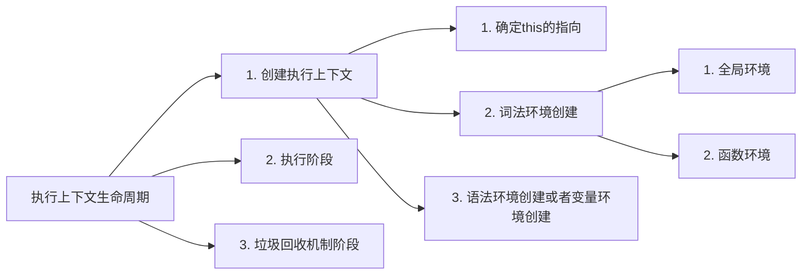
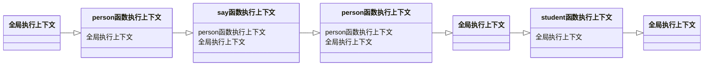

---
sidebar:
 title: 执行上下文和执行栈
 step: 10
isTimeLine: true
title: 执行上下文和执行栈
date: 2020-07-10
author: 马凯
tags:
 - 前端
 - JavaScript
categories:
 - 前端
---

# JavaScript中执行上下文和执行栈

:::tip
执行上下文和执行栈是JavaScript中的重要概念之一，理解了执行上下文和执行栈有助于理解JavaScript的运行机制、作用域和闭包等
:::

## 什么是执行上下文？

**执行上下文是指当前js代码被解析和执行时所处的环境的抽象概念，js代码的执行过程都是在执行上下文完成的。**

执行上下文和作用域不同，执行上下文只有在运行时才能创建，作用域在声明时就已经确定。


执行上下文的分类：
* **全局执行上下文**
> 全局只有一个全局执行上下文，浏览器的全局对象就是window对象，全局执行上下文中的this指向window，全局执行上下文只有在项目销毁时才会被垃圾回收机制处理。

* **函数执行上下文**
> 函数执行上下文存在无数个，只要有**函数调用**就会产生函数执行上下文

* **eval执行上下文**
> eval执行上下文是指eval函数，eval函数会将字符串转化为js代码进行执行，所有性能很差


JavaScript可以有任意多个执行上下文被创建存储到调用栈内，每次函数调用都会产生一个新的执行上下文，同时会创建一个私有作用域，函数内部声明的任何变量都不会被外部作用域访问到，除非是子作用域，或者闭包。

只有全局执行上下文内的变量可以被其他的上下文访问。


## 执行上下文的生命周期



### 创建阶段
* 确定this的指向
> this的指向，或者说this的值只有在函数被调用时，才能确定，定义的时候未执行，所以不能确定

* 词法环境创建
    1. 全局环境创建，是一个没有外部环境的词法环境，其外部环境对象为null，该全局对象指向window对象
    2. 函数环境，函数内部定义私有变量、实例属性以及方法都会被存储在函数环境内，函数环境的外部环境可能是全局环境也可能是包含当前函数环境的其他函数环境

* 语法环境创建或者变量环境
> 变量环境也是一种词法环境，包含了词法环境所有的功能，区别在于词法环境用存储函数声明和块级作用域变量的绑定（let/const），而变量环境仅用于存储var声明变量的存储。


### 执行阶段
该阶段用于执行变量的赋值以及执行上下文的执行，该阶段如果读取到未赋值的变量，则将其值分配为undefined


### 回收阶段
该阶段执行上下文已经执行完毕，推出执行栈，触发垃圾回收机制

## 执行栈

执行栈也称为调用栈，用于存储代码执行期间创建的执行上下文。

**如果是同步任务，或者异步待执行任务则是顺序读取执行，保持先进先出，如果是callback调用，例如函数a内部调用函数b，函数b又调用c，则具有先进后出的性质。**

```ts
const name = 'nihao'

function person() {
  console.log('person')
  function say() {
    console.log('hello world')
  }
  say()
}

person()

function student() {
  console.log('student')
}

student()
// 执行结果如下
// person
// hello world
// student
```

根据先进后出的原则，可以使用一下流程图解释


执行流程分析：
1. 有函数需要执行，首先肯定要创建全局执行上下文
2. person函数被调用执行，创建person的函数执行上下文，导入执行栈内
3. 执行person的过程中，发现函数say，进而执行say，在创建一个say的执行上下文塞进执行栈内
4. say执行完毕，对应的执行上下文被推出，继续执行person的上下文
5. person执行完毕后，被推出
6. js继续执行遇到student函数，创建student的函数执行上下文，导入执行栈内执行
7. student执行完毕之后被推出，这时仅剩全局执行上下文


## 参考
* [面试官：JavaScript中执行上下文和执行栈是什么？](https://github.com/febobo/web-interview/issues/63)