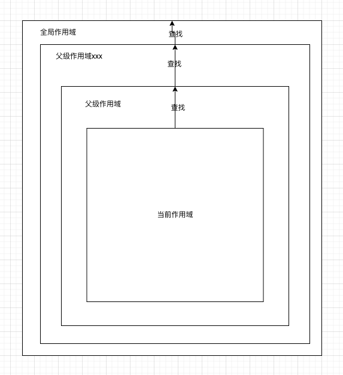

---
sidebar:
 title: 说说你对作用域、作用域链的理解？
 step: 10
isTimeLine: true
title: 说说你对作用域、作用域链的理解？
date: 2020-07-14
author: 马凯
tags:
 - 前端
 - JavaScript
categories:
 - 前端
---

# 说说你对作用域、作用域链的理解？

## 作用域

作用域是指变量作用域（是指上下文） 和函数生效（能被访问）的区域集合。

作用域规定了如何查找变量，也就是确定了当前代码对变量的访问权限。
```ts
function func() {
  const visible = '函数内部私有变量'
}
func() // 需要执行函数否则函数不创建执行上下文，就无法直到内部有啥

console.log(visible) // Uncaught ReferenceError: visible is not defined
```

上述例子说明函数内部私有变量是不允许外部访问的，否则会报错，闭包除外，因为闭包将父函数内部私有变量引用后返回了，也就佐证了上边那句话。

JS代码执行流程就是遵循的词法作用域，也称为静态作用域。


### 作用域分类

* 词法作用域
> 词法作用域又称为静态作用域，变量在创建时，它的作用域就已经固定了，而不是在执行阶段确定作用域。JS代码执行流程就是遵循的词法作用域
* 动态作用域
> 函数的作用域是在函数调用的时候，确定的, bash脚本属于动态作用域
* 函数作用域
> 函数作用域也叫做局部作用域，如果一个变量实在函数内部声明的那么他就只能在该函数的作用域下使用，外部无法访问，除非使用闭包
* 块级作用域
> es6引用了let、const作为声明关键字，与var不同的是let/const只能在声明变量的块级作用域内使用，例如{}内的声明和函数内的声明，不能被外部使用
* 全局作用域
> 全局作用域是指在全局任意地方都可以被访问到的变量，通常指任何不在函数 或者 花括号内的声明变量


### 函数作用域

函数作用域也称为是局部作用域，如果一个函数内部声明了私有变量，那么该变量无法在函数外部被访问。**闭包除外！！！**

沿用上方的例子：
```ts
function func() {
  const visible = '函数内部私有变量' // 私有基本数据变量
  const obj = {
    name: 'nihao'
  }
  function test() {
    console.log('test-function')
  }
  console.log(visible, obj, test)
}
func() // 函数内部私有变量

console.log(visible) // Uncaught ReferenceError: visible is not defined
```

由上方的例子可以看出,函数内部声明的私有变量、私有方法，均无法在函数外部被访问，这说明函数内部声明的私有属性及方法只能在函数作用域有效。


### 块级作用域

块级作用域是es6语法新增声明方式，let、const，这两个声明方式和var不同，
let 和 const 会造成暂时性死区，前提是提前访问
var会造成变量提升

let、const的声明存放于块级作用域内，无法被外部访问。
```ts
if (true) {
  const name = 'nihao'
  // eslint-disable-next-line prefer-const
  let age = 12
  console.log(name, age) // 打印 nihao 12
}
console.log(name, age) // 提示错误，Uncaught ReferenceError: name is not defined
```

但是如果是var声明就可以，因为var造成了变量提升
```ts
if (true) {
  var age = 12
  console.log(age)
}

console.log(age)
// 结果是打印两次12
```


### 全局作用域

**任何不在函数或者{}内声明的变量都是属于全局作用域下，全局作用域下的声明变量可以在程序任意地方调用**
例如：
```ts
const say = '你好世界'

function test() {
  console.log(say)
}

test() // 你好世界
```

### 动态作用域

> **动态作用域只有在函数被调用时确定，bash脚本就是使用的动态作用域**

```bash
value = 1

function test() {
    echo value;
}

function test2() {
    local value = 2;
    test;
}

test2 // 2
```

## 词法作用域

> **词法作用域又称为静态作用域，变量在创建时，它的作用域就已经固定了，而不是在执行阶段确定作用域。JS代码执行流程就是遵循的词法作用域**


```ts
const a = 1

function foo() {
  console.log(a)
}

function say() {
  const a = 22
  foo()
}

say() // 以上示例最终打印的是1
```

结果分析：

***因为js属于静态作用域，那么在say中执行foo的时候，foo函数首先会在内部查找是否存在 a， 如果没有则向父级作用查找，那么根据foo声明的位置，它处于全局作用域下，所以自然在全局作用域下找到了 a = 1***


## 作用域链

**当JavaScript语句中使用了某个变量时，JavaScript引擎首先会在当前作用域内查找该变量，如果没找到则会向父级作用域查找该变量，依此类推直到查找到变量，或者到达全局作用域下，则停止查找，那么这个查找的作用域关系称为作用域链。**

如果在全局作用域下仍然未找到目标变量，则会查找全局作用域下的隐式声明或者直接报错。



变量的查找会按照如图所示的包裹路径进行查找，首先会在当前作用域查找，没找到，则一层层向父作用域查找，直到顶层作用域或者找到则停止。


```ts
const name = 'xiaoming'

function say() {
  const age = 12

  function person() {
    const sex = '男'

    console.log(`我是${name},${sex}, 年龄：${age}`)
  }
  console.log(sex) // 抛出错误，提示sex未声明
  person()
}

say()
```

代码分析：

1. Person函数的作用域属于say的最内层作用域，所以person执行时，遇到name和age均不在当前person作用域内声明，所以会向上层作用域查找，分别在父作用域找到age，在全局作用域找到name

2. say执行时，内部未声明sex，所以会向父作用域查找，say的父作用域为全局作用域，全局作用域下未声明sex，所以抛出错误


**未在当前作用域内声明的变量称为自由变量，参数name和age对于person函数来说就是自由变量**


## 参考
* [JavaScript深入之词法作用域和动态作用域](https://github.com/mqyqingfeng/Blog/issues/3)
* [面试官：说说你对作用域链的理解](https://github.com/febobo/web-interview/issues/58)