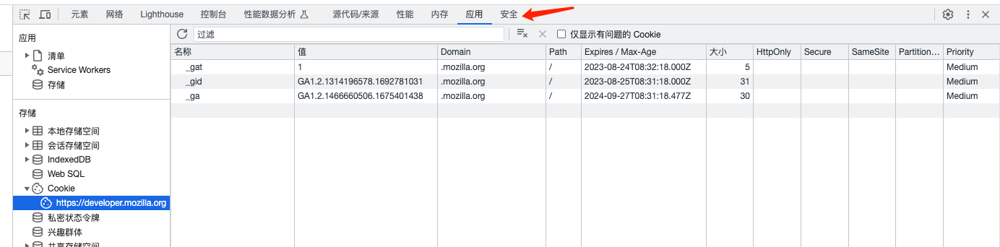

--- 
siderbar: 
    title: 本地存储方法有哪些？他们的区别是什么？
isTimeLine: true
title: 本地存储方法有哪些？他们的区别是什么？
date: 2020-08-19 17:00:00
author: 马凯
aside: true
tags:
 - 前端
 - JavaScript
categories:
 - 前端
---

# 本地存储方法有哪些？他们的区别是什么？

## 本地存储的类型

本地存储又称为浏览器存储，通过操作能够存储用的信息到浏览器内。

* localStorage
* sessionStorage
* cookie
* indexDB


共同点：
* 全都受同源策略约束
* 存储方式否是字符串
* 都是浏览器的本地存储


### localStorage

html5新特性，IE8及以上都兼容。

**特点**
* localStorage在浏览器具有持久性，如果不主动删除，则一直存在，没有过期时间
* 存储信息在同域环境下是共享的
* 存储大小一般为5M，具体跟浏览器有关
* localStorage本质上操作的是字符串，所以在存储时需要进行JSON.stringify和JSON.parse转换
* 受制于同源策略

**localStorage的操作方法**

1. 设置:
```js
localStorage.setItem(key, value)
```

2. 获取:
```js
localStorage.getItem(key)
```

3. 清理:
```js
localStorage.clear()
```

4. 获取键名
```js
localStorage.keys()
```

### sessionStorage

sessionStorage的操作方法和属性与localStorage一致，但是sessionStorage会在浏览器关闭tab标签时进行清理。


### cookie

cookie一般用于存储用的身份信息或者登录信息，为了解决http无状态导致的问题；属于小文件存储，一般存储大小为4K。

cookie在每次http请求都会通过请求头被携带，如果不使用https加密，其保存的信息容易被窃取，有一定的安全风险。

例如如果能切渠道个人的cookie，通过复制cookie值，在另外一个地方进行登录。

**cookie的常用属性**
* name cookie的名字(键)
* value cookie存放的值
* expires：指cookie过期的时间（该时间为世界时间  UTC时间）也称为格林威治时间
* max-age:指cookie最大的存活有效期（单位：秒）
* domain: 指的是cookie当前的域
* path:指cookie当前的路径
* size:指cookie存放的大小
* secure:指cooke的安全属性



**注意：expires和max-age的默认值为session代表关闭浏览器(回话存储)，该cookie则清空、失效**

**cookie的相关属性设置**

```js
// Set-Cookie:name=aa; domain=aa.net; path=/  # 服务端设置
document.cookie = 'name=bb; domain=aa.net; path=/;expires=new Date().toUTCString()' // 客户端设置
```


### indexDB 浏览器特殊存储类型

indexDB又称为浏览器数据库，能够通过JS操作API，通过索引实现对数据的高性能搜索。

相对Web Storage来说存储量更大，更适合大量数据的存储。

常用于浏览器端的富文本保存编辑，修改历史等。

**优点：**
* 储存量理论上没有上限
* 所有操作都是异步的，相比 LocalStorage 同步操作性能更高，尤其是数据量较大时
* 原生支持储存JS的对象
* 是个正经的数据库，意味着数据库能干的事它都能干

**缺点：**
* 操作非常繁琐
* 本身有一定门槛

关于indexedDB的使用基本使用步骤如下：

打开数据库并且开始一个事务

创建一个 object store

构建一个请求来执行一些数据库操作，像增加或提取数据等。

通过监听正确类型的 DOM 事件以等待操作完成。

在操作结果上进行一些操作（可以在 request 对象中找到）

关于使用indexdb的使用会比较繁琐，大家可以通过使用Godb.js库进行缓存，最大化的降低操作难度

## 不同点
关于cookie、sessionStorage、localStorage三者的区别主要如下：

* 存储大小： cookie数据大小不能超过4k，sessionStorage和localStorage 虽然也有存储大小的限制，但比cookie大得多，可以达到5M或更大

* 有效时间：localStorage  存储持久数据，浏览器关闭后数据不丢失除非主动删除数据； sessionStorage  数据在当前浏览器窗口关闭后自动删除；cookie设置的cookie过期时间之前一直有效，即使窗口或浏览器关闭

* 数据与服务器之间的交互方式，  cookie的数据会自动的传递到服务器，服务器端也可以写cookie到客户端； sessionStorage和localStorage不会自动把数据发给服务器，仅在本地保存

## 参考

* [面试官：Javascript本地存储的方式有哪些？区别及应用场景？](https://github.com/febobo/web-interview/issues/79)