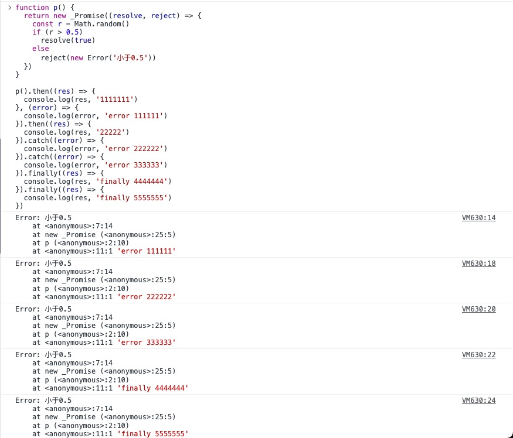

---
sidebar:
 title: 如何手写Promise?
 step: 10
isTimeLine: true
title: 如何手写Promise?
date: 2020-07-11
author: 马凯
tags:
 - 前端
 - JavaScript
 - 算法
categories:
 - 前端
---

# 如何手写Promise

:::tip

JavaScript中Promise是es6新增的特性，能够实现异步调用，

优点：
1. 解决了JS代码的回调地狱
2. 代码简洁，语句清晰
3. 能够实现链式调用

不足点：
1. 相对generater函数和async、await还是不够简洁


概念：Promise内部有三种状pending、fulfilled、rejected，这三种状态属于不可逆状态
:::

## 基本使用
```ts
const promise = new Promise((resolve, reject) => {
  if (Math.random() > 0.5)
    resolve(true)

  else
    reject(new Error('sss'))

})

promise.then((result) => {
  console.log(result)
}, (error) => {
  console.log(error)
}).catch((error) => {
  console.log(error)
}).finally(() => {
  console.log('finally 1')
}).finally(() => {
  console.log('finally 2')
})
```

**promise的三种状态只能是pending -> fulfilled，或者 pending -> rejected， 顺序状态不可逆**

## 简单实现

```ts
function _Promise(exec) {
  // 声明实例属性
  this.status = 'pending'
  this.value = ''
  this.resolveCallbacks = [] // 用于存储成功和失败的回调
  this.rejectCallbacks = []
  const ctx = this
  const resolve = function (value) {
    if (ctx.status === 'pending')
      ctx.status = 'fulfilled'
    ctx.value = value
    ctx.resolveCallbacks.forEach(fn => fn())

  }

  const reject = function (error) {
    if (ctx.status === 'pending')
      ctx.status = 'rejected'

    ctx.value = error
    ctx.rejectCallbacks.forEach(fn => fn())
  }

  try {
    exec(resolve, reject)
  }
  catch (error) {
    reject(error)
  }
}

_Promise.prototype.then = function (onResolve, onReject) {
  onResolve = typeof onResolve === 'function' ? onResolve : v => v
  onReject = typeof onReject === 'function' ? onReject : v => v

  if (this.status === 'fulfilled')
    onResolve(this.value)

  if (this.status === 'rejected')
    onReject(this.value)

  if (this.status === 'pending') {
    this.resolveCallbacks.push(() => onResolve(this.value))
    this.rejectCallbacks.push(() => onReject(this.value))
  }
  // 返回this 用于可以继续使用.then，同时可以继续使用promise的状态
  return this
}

_Promise.prototype.catch = function (onReject) {
  onReject = typeof onReject === 'function' ? onReject : v => v
  if (this.status === 'pending')
    this.rejectCallbacks.push(() => onReject(this.value))

  if (this.status === 'rejected')
    onReject(this.value)

  // 返回this 用于可以继续使用.then，同时可以继续使用promise的状态
  return this
}

_Promise.prototype.finally = function (_finally) {
  return this.then((value) => {
    _finally(value)
  }, (error) => {
    _finally(error)
  })
}
```

**测试**
```ts
function p() {
  return new _Promise((resolve, reject) => {
    const r = Math.random()
    if (r > 0.5)
      resolve(true)
    else
      reject(new Error('小于0.5'))
  })
}

p().then((res) => {
  console.log(res, '1111111')
}, (error) => {
  console.log(error, 'error 111111')
}).then((res) => {
  console.log(res, '22222')
}).catch((error) => {
  console.log(error, 'error 222222')
}).catch((error) => {
  console.log(error, 'error 333333')
}).finally((res) => {
  console.log(res, 'finally 4444444')
}).finally((res) => {
  console.log(res, 'finally 5555555')
})
```

**执行结果**
