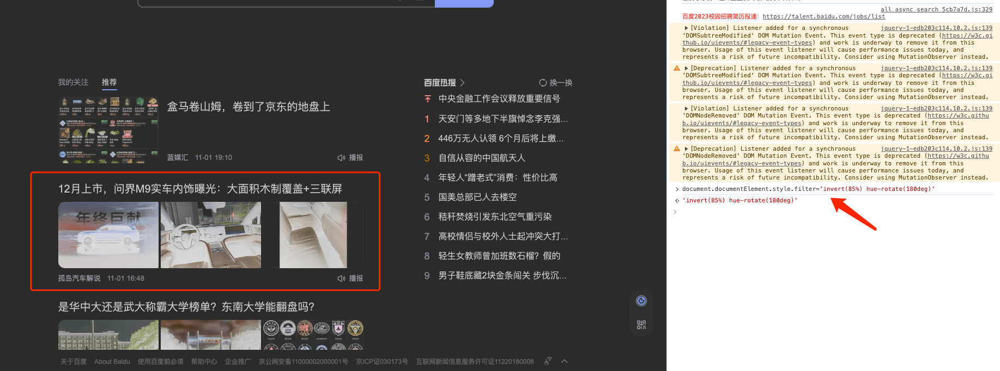
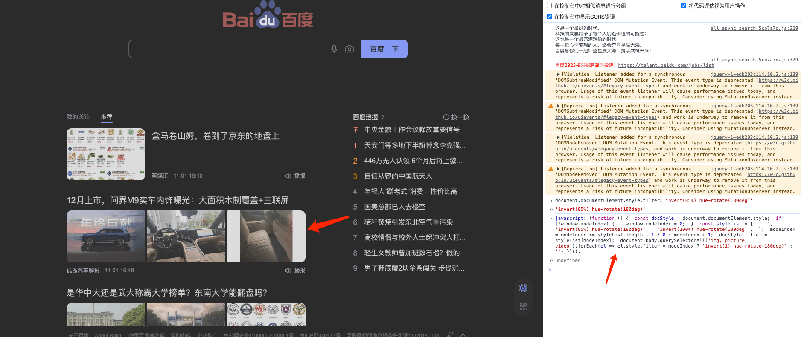

---
sidebar:
 title: 一行代码实现前端页面暗黑模式
 step: 10
isTimeLine: true
title: 一行代码实现前端页面暗黑模式
date: 2021-01-28
author: 马凯
tags:
 - 实用技巧
 - JavaScript
categories:
 - 实用技巧
---

# 一行代码实现前端页面暗黑模式

> 利用css的滤镜filter，翻转渲染颜色能够实现暗黑模式

## 功能实现

```js
document.documentElement.style.filter = 'invert(85%) hue-rotate(180deg)'
```

> 尝试将该段代码在控制台执行

以百度搜索为例

通过上述代码实现暗黑模式后，图片渲染发生了错误，导致图片色被翻转。




## 优化

```js
function darkMode() {
  const docStyle = document.documentElement.style
  if (!window.modeIndex)
    window.modeIndex = 0
  const styleList = ['', 'invert(85%) hue-rotate(180deg)', 'invert(100%) hue-rotate(180deg)']
  modeIndex = modeIndex >= styleList.length - 1 ? 0 : modeIndex + 1
  docStyle.filter = styleList[modeIndex]
  document.body.querySelectorAll('img, picture, video').forEach(el => el.style.filter = modeIndex ? 'invert(1) hue-rotate(180deg)' : '')
}
```

优化后执行结果




## 原理解析

1. document.documentElement 获取文档对象的根元素，即html元素
2. 给html元素的.style样式添加filter滤镜样式为invert(85%) hue-rotate(180deg)
3. invert() 反转图像。
4. hue-rotate()色相旋转。

更多滤镜知识：[filter](https://developer.mozilla.org/zh-CN/docs/Web/CSS/filter)。

